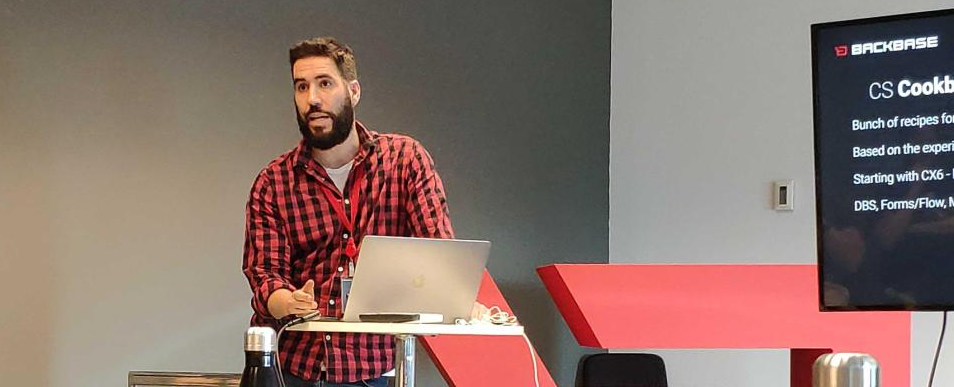

### Hi there 👋

Hi. I’m Andrés Torres. I am a Software Engineer from Spain 🇪🇸, living in London 🇬🇧 (#bollocksToBrexit) and working for a Dutch company 🇳🇱.

I work at [Backbase](http://www.backbase.com) as Director of Backend. For more information about me,
check out [atorr.es](http://atorr.es/).

I write articles for [**Medium**](https://medium.com/@towerspro) 

<!--
**torrespro/torrespro** is a ✨ _special_ ✨ repository because its `README.md` (this file) appears on your GitHub profile.

Here are some ideas to get you started:

- 🔭 I’m currently working on ...
- 🌱 I’m currently learning ...
- 👯 I’m looking to collaborate on ...
- 🤔 I’m looking for help with ...
- 💬 Ask me about ...
- 📫 How to reach me: ...
- 😄 Pronouns: ...
- ⚡ Fun fact: ...
-->
